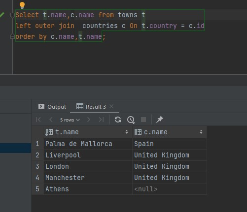
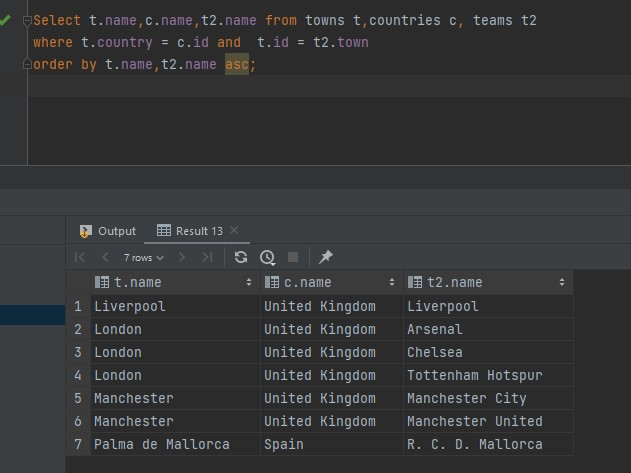
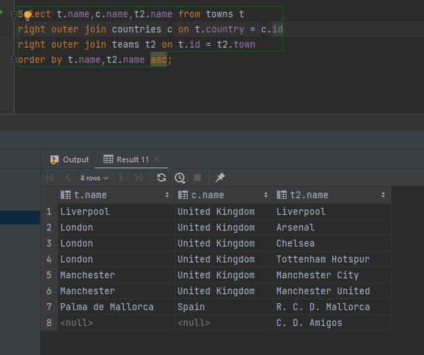
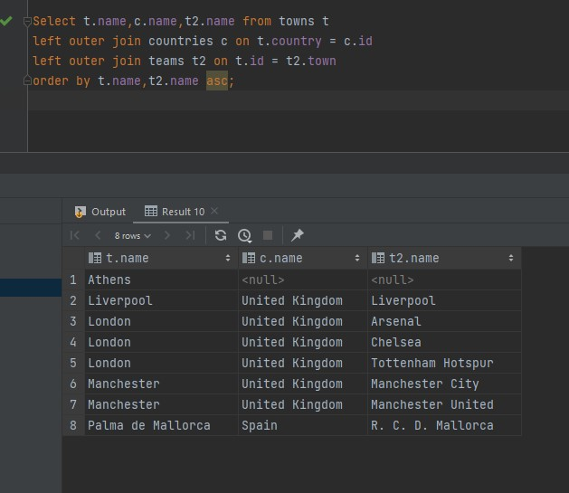
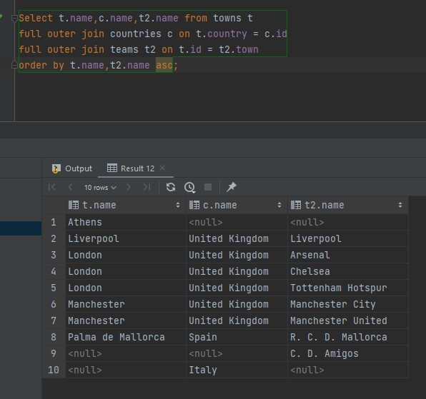
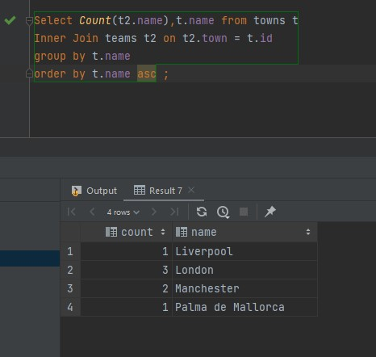
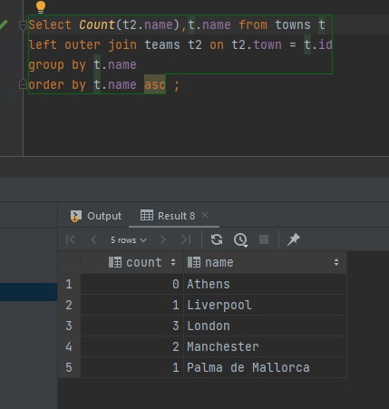

# BaseDatosConDataGrip

## Descargamos todo lo necesario 
---

Lo primero que he hecho ha sido pedir las licencias para estudiantes que nos dan en Github, despues de eso vamos a la paguina de JetBrains y buscamos descargar la aplicacion de datagrip 

---

Despues para poder usar la base de datos que nos proporcionan tenemos que tener un servidor donde poder usarla, como vamos a usar posgressql, nos descagaremos del su paguina su servidor local para poder conertar con el y poder ejecutar ahi la base de datos 

---

Finalmente como ya tenemos todo conectado, creamos una base de datos y ejecutamos todo nuetro codigo y creamos la base de datos de MisoccerLegue

## 1º Ejercicio 
---

Para este ejercicio tenemos que mostras el nombre de las ciudades y de los paises ordenados por el nombre del pais y de la ciudad con 4 versiones 

Usando Inner Join Explicito 

Usando Inner Join Implicito

Usando Right Outer Join

Usando Left Outer Join

---

## 2º Ejercicio 
---

Para este ejercicio tenemos que mostras el nombre de los equipos con sus ciudades u sus paises, el resultado ordenado por ciudades y paises con 5 versiones

Usando Inner Join Explicito 

Usando Inner Join Implicito

Usando Right Outer Join

Usando Left Outer Join

Usando Full outer Join

---

## 3º Ejercicio 
---

Para este ejercicio tenemos que mostras cuantos equipos tinene cada ciudad, ordenado por el  nombre de la ciudad 2 versiones

Usando Inner Join Explicito 

Usando Left outher Join

---

## 4º Ejercicio 
---

Para este ejercicio tenemos que mostras las ciudades que no tienen equipos usando un Left outer join

